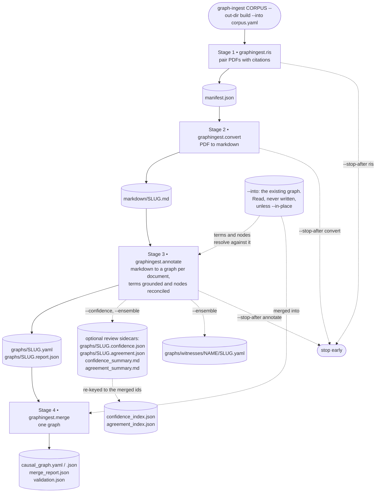
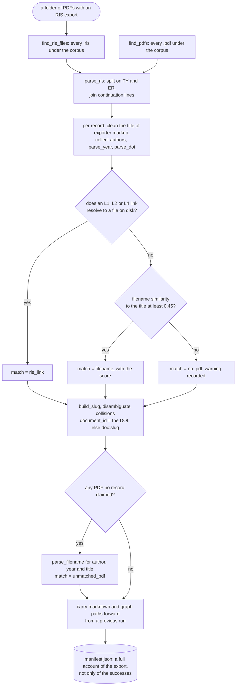
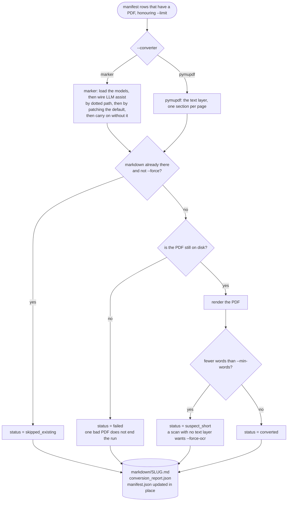
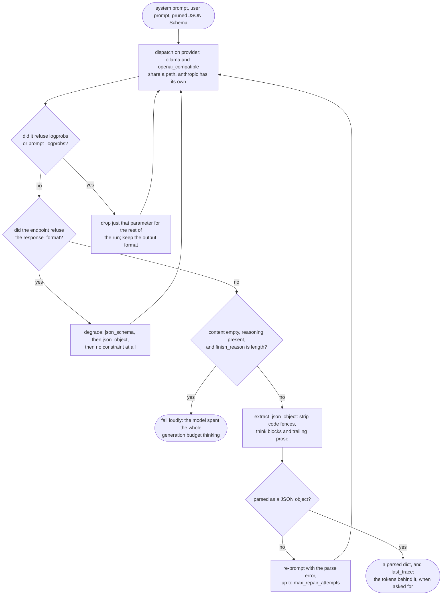
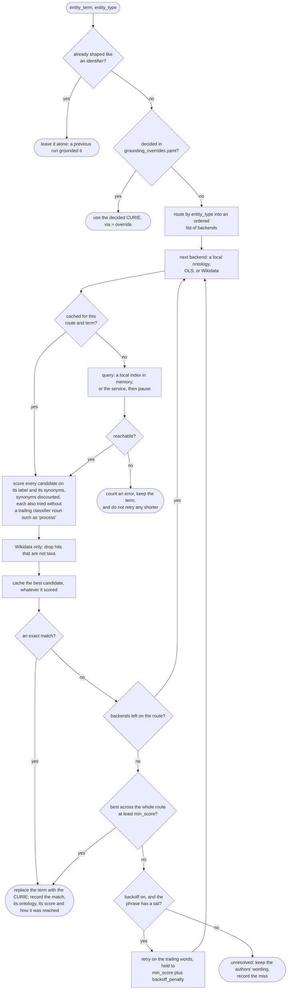
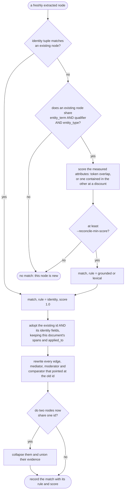
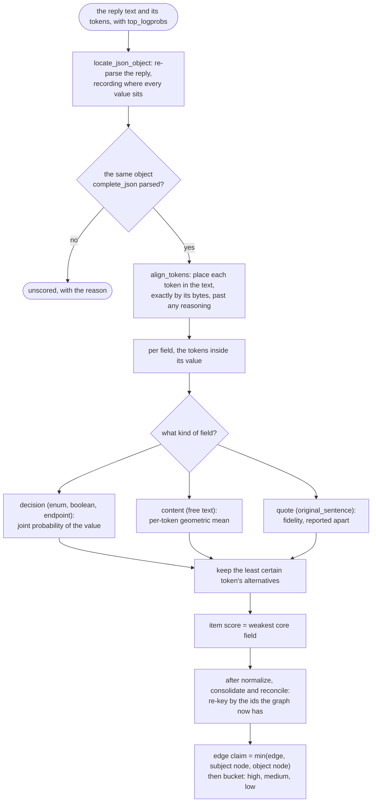
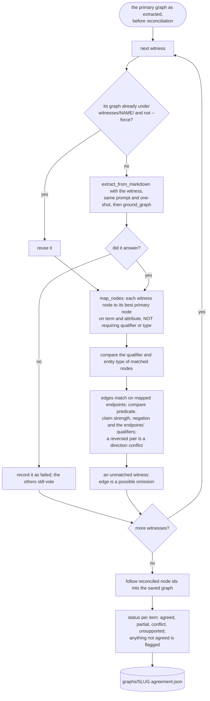
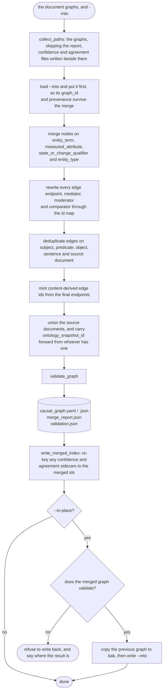

# graphingest

Point it at a folder of PDFs with an RIS export and get back a Causal Mosaic
graph, merged into the one you already have.

```bash
python -m graphingest.run "/path/to/mosquito_corpus" \
    --out-dir build \
    --into ~/mosaic/causal_graph.yaml \
    --example examples/murphy_2005_camo_annotation_revised.yaml \
    --domain "restoration ecology"
```

Four stages, each resumable and each usable on its own:

```
graphingest.ris       PDFs + RIS      ->  corpus manifest
graphingest.convert   manifest        ->  markdown articles
graphingest.annotate  markdown        ->  one graph per document, terms grounded
                                          and nodes matched to the existing graph
graphingest.merge     document graphs ->  one graph, merged into an existing one
```

Two resolution steps run inside `annotate`, and they are the difference between
an ingest and a pile of parallel graphs. **Grounding** resolves each term to an
ontology — ELMO first, then the public ones. **Reconciliation** resolves each
*node* against the graph you are adding to, so a node the corpus already has is
that node rather than a near-duplicate of it. Both happen in Python, both are
fully reported, and both can be switched off.

Two optional review aids tell a person which extractions to check first. They
never change the graph:

- **`--confidence`** asks the endpoint for token logprobs and scores every
  node and edge by how sure the model was. It keeps the alternatives it
  weighed, e.g. *decreased* 0.55 with *increased* 0.40 behind it.
- **`--ensemble`** has one or more *witness* models extract the same articles.
  Every claim the primary model made is marked agreed, partial, conflict or
  unsupported, and the claims only the witnesses found are listed as possible
  omissions.

Each writes a sidecar beside every graph and a summary written for reviewers.
See [How sure was the model?](#how-sure-was-the-model---confidence) and
[Do other models agree?](#do-other-models-agree---ensemble).

Nothing here hardcodes a schema or an inference provider. The LinkML file
passed as `--schema` drives the prompt, the output constraint, the normalizer
and the validator together; `config/pipeline.yaml` decides where inference runs
and how terms are grounded.

## Setup

```bash
pip install -e .
pip install -e ".[marker,dev]"     # layout-aware PDF conversion, tests
```

Install it editable: the schema, the config and the worked examples live beside
the package rather than inside it, and the default paths point at this
directory.

## Where inference runs

`config/pipeline.yaml` is the single point of control, read through
`graphingest.llm_client` — the only module that knows about providers. Repoint
that file to move the whole pipeline to another machine, or to another
provider: a **Claude (Anthropic)** block ships commented out beside the Ollama
one, so switching is an edit to that file and `pip install -e ".[anthropic]"`,
with `LLM_API_KEY` in the environment. Nothing else in the pipeline changes.

```yaml
llm:
  provider: ollama          # ollama | openai_compatible | anthropic
  endpoint: "${LLM_ENDPOINT:-http://localhost:11434/v1}"
  model: "${LLM_MODEL:-qwen3.6:35b}"
  max_tokens: 16384         # GENERATION budget, not context size
  structured_output: json_object
```

Three things worth knowing, all learned the hard way and all encoded as
defaults:

- **`max_tokens` is an output budget, and a reasoning model will spend it
  thinking.** Set too low, qwen3.x emits 36,000 characters of reasoning, hits
  the limit and returns empty content. The client detects exactly that and says
  so, instead of reporting an opaque empty response. Set too high, a weaker
  model that loses the thread rambles to the limit and a 40-second call becomes
  a 20-minute one.
- **`json_object`, not `json_schema`.** The full CAMO JSON Schema is ~65 KB
  across 44 definitions and Ollama returns a 500 rather than compile a grammar
  that big. Extraction sends a pruned schema and asks only for valid JSON; the
  shape comes from the prompt, and correctness comes from normalizing and
  validating the result afterwards. If a mode is refused the client degrades
  automatically rather than failing.
- **Ollama's context window is set per model, not per request.** A whole
  article plus the schema plus a one-shot example runs to ~25k tokens, so point
  at a model built with the context to hold it, or pass
  `--max-chunk-characters` to send the article in pieces.

Server-specific switches go in `llm.extra_body`, which is passed through
verbatim on every OpenAI-compatible request. The one this pipeline has a use
for is vLLM's `chat_template_kwargs: {enable_thinking: false}` for Qwen3,
which matters for `--confidence` (see below).

The `llm:` block is also the **primary** model for `--ensemble`. Witness
models are declared separately under `ensemble.witnesses`, and each inherits
this block's endpoint, key and budget when it shares a provider.

On the Claude path three things differ, and the commented block in
`config/pipeline.yaml` spells out why: `endpoint` is ignored (the SDK knows
where the API is), `temperature` is not sent (Claude 4.6 and later removed the
sampling parameters — sending one is a 400, so the client drops it on refusal
and remembers), and `max_tokens` wants to be larger because extended thinking
is on by default on `claude-opus-5` and its tokens come out of the same budget.
Use `structured_output: tool_use` there: it forces a single tool call whose
`input_schema` is the pruned extraction schema, which is the closest thing to a
grammar the Messages API offers. The Messages API returns no logprobs, so
`--confidence` reports every item as unscored on this path. Claude still works
as a primary or a witness for `--ensemble`, which needs no logprobs.

## Ontology grounding happens in Python

The model is **never** asked for an ontology identifier. Asked for one it will
produce something shaped exactly like a real CURIE — `ENVO:00002006`, `Q56987`
— that denotes the wrong thing, or nothing at all, and nothing about the string
tells you which. So the prompt asks for plain language and
`graphingest.ground` looks the terms up afterwards:

```
"Aedes dorsalis"          -> Q13543883       Aedes dorsalis           (wikidata)
"ditch plugging"          -> elmo:3620072    ditch plugging process   (elmo)
"prescribed burning"      -> elmo:3621037    prescribed fire process  (elmo, via synonym)
"grubbing"                -> elmo:3620022    grubbing process         (elmo, suffix ignored)
"water table depth"       -> ENVO:06105203   water table depth        (envo, imported into elmo)
"salt marsh"              -> ENVO:00000054   saline marsh             (envo, via synonym)
"soil salinity"           -> PATO:0085001    salinity                 (backoff to the head noun)
"phosphorus"              -> CHEBI:28659     phosphorus atom          (curated override)
"tidal flushing"          -> unresolved, left as the authors wrote it
"Parker"                  -> unresolved (a search hit that is not a taxon is rejected)
```

The difference that matters is not accuracy but **failure behaviour**. A lookup
that finds nothing records a miss and leaves the term alone; a hallucinated
identifier is indistinguishable from a correct one until somebody dereferences
it. Every decision — match, miss, override, backoff — lands in
`grounding_report.json` and in each document's `<slug>.report.json`.

Routing is by entity type, and a route is an ordered *list*, in
`config/pipeline.yaml`:

```yaml
grounding:
  min_score: 0.6
  ontologies:
    elmo:
      source: "https://raw.githubusercontent.com/timalamenciak/elmo/refs/heads/main/elmo.owl"
      prefix: elmo
  routes:
    taxon: wikidata                        # filtered to items that really are taxa
    environmental_variable: ["local:elmo", "ols:envo,pato,chebi"]
    environmental_process:  ["local:elmo", "ols:envo,go"]
    management_intervention: ["local:elmo", "ols:envo,go"]
    default: ["local:elmo", "ols:envo,go,chebi,pato"]
```

Backends: `local:<name>` for an ontology file (URL or path), `ols` (EBI Ontology
Lookup Service), `wikidata`, `oaklib:<spec>`, and `none`. `--no-ground` skips
lookup entirely. Every lookup is cached to `grounding_cache.json` by term, so a
corpus that mentions *Aedes dorsalis* in nine papers costs one request and a
re-run costs none.

### ELMO, and other ontologies nobody hosts

`local:` loads an ontology file directly, which is the only way to ground
against one no lookup service carries — and the only way to ground at all with
no outbound network. ELMO is configured this way by default: fetched once into
`ontologies/`, reduced to a term index of CURIEs, labels and synonyms, and
searched in memory. The index is rebuilt when the source file changes or the
prefix map does, and `--refresh-ontologies` forces it.

It earns its place in the route. Of the management terms this corpus uses,
ELMO resolves *ditch plugging*, *canopy thinning*, *grubbing* and *prescribed
burning*; the public ontologies resolve none of them. Four details matter:

- **CURIEs come from the schema's own prefix map.** An ELMO IRI becomes
  `elmo:3622713` — the CURIE CAMO's enums already use — rather than one this
  code invented, which would agree with nothing downstream.
- **An imported term keeps its own identity.** ELMO imports ENVO, GO and PATO
  terms; reached through ELMO, `ENVO:06105203` is still ENVO, and the report
  says so.
- **A classifier suffix does not block a match.** ELMO ends 232 of its 652
  class labels with "process", so "grubbing" is matched against both "grubbing
  process" and "grubbing". The suffix is the ontology saying what kind of thing
  a term is, not part of what the authors called it.
- **People are not vocabulary.** An ontology credits its authors with ORCIDs,
  and those are excluded from the index. "Tim Alamenciak" is not a thing a
  causal claim is about.

Five things the routing deliberately does:

- **Preference decides ties, not contests.** ELMO comes first, but the best
  match across the route wins. ELMO offers "Inland Salt Marsh" for *salt marsh*
  at 0.67 and ENVO offers "saline marsh" at 0.98; taking the first would ground
  a coastal corpus to an inland ecosystem. An *exact* match in an earlier
  backend does short-circuit, so a term ELMO names outright never costs a
  request to a public service.

- **Taxon hits are verified, not trusted.** A Wikidata search for "Parker"
  returns a surname; only items carrying `taxon name` or `instance of: taxon`
  are accepted.
- **Ties break on the ontology order in the route.** For ecology an ENVO term
  is a better answer than an equally-scoring CHEBI one.
- **A phrase that resolves to nothing is retried on its tail**, where English
  puts the head noun, held to a higher score because it discards part of what
  the authors wrote. Every such match is recorded as `via: backoff:<query>`.
- **Decided cases live in `config/grounding_overrides.yaml`.** CHEBI's best
  lexical match for "phosphorus" is `tetraphosphorus`, the P4 allotrope, which
  carries "phosphorus" as an exact synonym — a different claim about the world
  that no similarity threshold can separate from the right one. Only a person
  can, so those decisions are written down with their reasoning.

Grounding runs **before** merging, per document. That is what lets the merge
recognise that "Aedes dorsalis" in one paper and "Ae. dorsalis" in another are
the same node.

## Extraction resolves against the graph it is joining

Grounding resolves a term. Reconciliation resolves a *node*: "increased larval
abundance of *Aedes dorsalis*" extracted from a new paper is the node three
earlier papers already talk about, and it should be that node, not a fourth
copy. Pass `--into` (or `--against` on `graphingest.annotate`) and every
extracted node is matched against the existing graph before the document graph
is written, adopting the existing node's id and identity where the two are the
same thing. The merge then joins them for free, and the corpus accumulates
evidence on one node instead of growing near-duplicates.

Merging by exact identity — what the merge stage does on its own — is too
strict, because annotators qualify the same measurement to different depths:
"larval abundance" and "mosquito larval abundance" share two tokens of three.
So containment counts too, discounted. What does *not* count is morphology:
"larval abundance" and "abundance of larvae" stay two nodes, the report says
one went unmatched, and a person decides. Guessing at suffixes is not worth a
wrongly merged node.

**What is never merged**, whatever the wording:

- **Different `state_or_change_qualifier`.** "Increased salinity" and
  "decreased salinity" are opposite claims. The polarity lives on the node, so
  folding these together would invert half the evidence in the graph.
- **Different `entity_type`.** A taxon and an environmental variable are not
  the same node because they share a name.
- **Two different grounded terms.** A CURIE is an assertion, and two of them
  assert two different things.

`--reconcile-min-score` moves the bar (0.7 by default, deliberately higher than
the grounding threshold: grounding a term loosely costs one wrong CURIE,
merging two nodes wrongly costs every edge on both). `--no-reconcile` turns the
step off. Either way every match is recorded in the document's report with the
rule and score that produced it, so one you disagree with can be found:

```bash
python -m graphingest.reconcile build/graphs --against ~/mosaic/causal_graph.yaml --report-only
```

## The one-shot example

`--example` is the single most effective lever on output quality. It shows the
model the house conventions — node granularity, how much of a sentence to
quote, when to use which qualifier — that no amount of schema prose conveys.

It is also the one place where the "no identifiers" rule can leak. A hand
annotation has already been through grounding, so it contains `entity_term:
Q30019`, and a one-shot is imitated rather than read. Those identifiers are
therefore turned back into the labels they denote before the example goes into
the prompt. `--example-max-nodes` trims a large example to fit, keeping only
the edges whose endpoints survive, because a broken example teaches broken
output.

## How sure was the model? (`--confidence`)

```bash
python -m graphingest.run CORPUS --out-dir build --confidence
python -m graphingest.run CORPUS --out-dir build --prompt-logprobs     # vLLM: also score the article
```

Off by default, because it roughly doubles what a run writes. With it on, the
client asks for `logprobs` and `top_logprobs` on every generated token, and
`graphingest.confidence` ties each token back to the field it spells. It does
this by re-parsing the reply with character positions and aligning the tokens
to it by their bytes, skipping any reasoning preamble. Then:

- **A categorical field** (enum, boolean, `subject`/`object` reference) is
  scored by the joint probability of its value, and keeps the alternatives
  the model weighed at its least certain token. The alternatives are the
  useful part: `state_or_change_qualifier = decreased (0.55)`, with
  `increased` at 0.40 behind it, names the confusion rather than just
  flagging that one exists.
- **A free-text field** is scored per token (geometric mean), so a long phrase
  is not penalised for being long. **A quote** (`original_sentence`) is
  scored the same way and reported separately as *fidelity*: copying is
  near-certain, so a low score means the model paraphrased. Read it together
  with the existing "quote not found in the article" signal.
- **A node or edge** takes its weakest *core* field
  (`confidence.core_fields`: what makes the claim the claim). Every other
  field is recorded but does not move the bucket, so hesitation over
  `reversibility` does not demote "A causes B". **An edge's claim score** is
  also capped by its two endpoint nodes: a confident arrow between uncertain
  nodes is an uncertain claim.
- **Buckets:** high ≥ 0.9, medium ≥ 0.6, low below that. Both thresholds are
  set in `config/pipeline.yaml`.

Scores are followed through normalization, chunk consolidation and
reconciliation, so the sidecar is keyed by the ids the saved graph actually
carries. The graph is not touched and stays schema-valid.
`annotation_confidence` (the model's *stated* confidence, when it fills it)
is kept beside the token score and compared against it in the summary.

```
build/graphs/<slug>.confidence.json   per node and edge: score, bucket, every field,
                                      the alternatives, and (store_tokens) every token
build/confidence_summary.md           for reviewers: buckets, the claims to read first
                                      and why, the fields the model most often hesitates on
build/confidence_report.json          the same, as data
build/confidence_index.json           the sidecars re-keyed to the merged graph's ids
```

`--prompt-logprobs` (vLLM only) adds the *input* side: the article's
perplexity under the model, and its most surprising passages. It says
nothing about whether an extraction is right. What it catches is a bad
conversion: broken ligatures, a table flattened into a column of numbers, or
OCR noise all read as runs of very surprising tokens. It costs a logit per
prompt token on a ~25k-token prompt.

What these numbers are **not**: calibrated probabilities that a claim is true.
Use them to decide what to review first. Four limits matter:

- **Omissions are invisible.** Logprobs score what was written. A claim the
  model never extracted has no tokens. The "existence" probability recorded
  for each item (the token that opened it, versus closing the list) is a weak
  proxy at best.
- **Reasoning models look overconfident.** Qwen3 decides inside `<think>` and
  then copies the answer out, so the JSON's tokens are near-certain. The run
  reports `reasoning_tokens` so you can see when this is happening. To put the
  decisions back where the logprobs can see them, disable thinking with
  `llm.extra_body: {chat_template_kwargs: {enable_thinking: false}}` and
  measure what that does to quality.
- **Which distribution you get depends on the server.** Recent vLLM returns
  logprobs from the raw logits, before temperature and before the JSON
  grammar's mask (`--logprobs-mode` changes this). Scores from different
  server settings are not comparable.
- **The probability is for the literal string.** If the model wrote `reduced`
  and normalization coerced it to `decreased`, the score belongs to
  `reduced`.

The Anthropic API returns no logprobs. The run says so and reports every item
as `unscored`. An endpoint that refuses the parameter is retried without it,
and the output format is left alone.

## Do other models agree? (`--ensemble`)

```bash
python -m graphingest.run CORPUS --out-dir build --ensemble                 # witnesses from config
python -m graphingest.run CORPUS --out-dir build --witness openai/models/Llama-4 --witness sonnet
```

Logprobs cannot see a claim the model never wrote. A second and third model
can. This mode is optional: the model in the `llm:` block stays the
**primary**, and its graph is the one saved and merged, as without it. Each
**witness** (listed under `ensemble.witnesses`, or named with `--witness`)
extracts the same article with the same prompt and one-shot. Its graph is
grounded the same way and compared against the primary's:

| status | meaning |
|---|---|
| `agreed` | every witness found it and agreed on its compared fields |
| `partial` | some witnesses found it, none contradicted it |
| `conflict` | a witness found it and disagreed: qualifier, predicate, claim strength, negation, or direction |
| `unsupported` | no witness found it |

Anything not `agreed` is flagged. The other direction is the recall signal:
claims a witness extracted and the primary did not are listed as **possible
omissions**. They are ranked by how many witnesses found them, and
first by whether the primary already has both nodes and only the relation is
missing.

Nodes are matched by meaning, the way reconciliation matches them: entity
term and measured attribute, in grounded CURIEs where there are any.
Unlike reconciliation, the qualifier and entity type are *compared*, not
required to match. "Increased salinity" against "decreased salinity" is the
disagreement worth finding. An edge matches when its endpoints do, and the
endpoints' qualifiers count toward the edge's agreement, because the same
arrow between variables in opposite states is a different claim. Matching
runs on the primary graph as extracted, before reconciliation rewrites its
wording, and the verdicts then follow the ids into the saved graph.

```
build/graphs/<slug>.agreement.json          per node and edge: status, support (2/3),
                                            each witness's verdict and what differed
build/graphs/witnesses/<name>/<slug>.yaml   each witness's graph, reused on re-runs
build/agreement_summary.md                  flagged claims, possible omissions, how often
                                            each witness agrees, and (with --confidence)
                                            agreement against token confidence
build/agreement_report.json                 the same, as data
build/agreement_index.json                  the sidecars re-keyed to the merged graph
```

Witnesses can be added to a finished corpus: a document whose graph already
exists is checked against the witnesses without being re-extracted, and a
witness that has already run is read back from disk. A witness that fails on
a document is recorded, and the others still vote.

Agreement is not correctness. Every witness reads the same prompt and
one-shot, which is the largest shared cause of shared mistakes. So pick
witnesses from different model families, and read the per-witness agreement
rate: a weak witness disagrees for its own reasons. Before trusting the
statuses, run the ensemble on a gold-standard article and check that `agreed`
claims really are more often right than `unsupported` ones.

## Every step

UML activity diagrams of the whole pipeline. Rounded boxes are actions,
diamonds are decisions, cylinders are what lands on disk. Each label names the
function that does the work, so a box reads straight back into the source.

The four stages, and what passes between them:



Every stage is resumable: rerunning skips work whose output already exists,
unless `--force`.

### Stage 1 &mdash; pair PDFs with citations



### Stage 2 &mdash; PDF to markdown



### Stage 3 &mdash; markdown to a graph per document

Set up once, then repeated per document. The two resolution steps, and the
two optional review aids, are drawn out below. Dotted arrows are the optional
paths.

```mermaid
flowchart TD
    P0(["once, before the loop"]) --> P1
    P1["build_extraction_profile: the LinkML schema becomes<br/>classes, slots, enums, CURIE prefixes, identifier flags"]
    P2["grounder_from_config: routes, curated overrides,<br/>fetch and index each local ontology such as ELMO"]
    P3["load_example: turn the gold standard's CURIEs back into<br/>labels, trim to --example-max-nodes"]
    P4["NodeReconciler over --into, read-only"]
    P5["LLMClient from config/pipeline.yaml,<br/>asking for logprobs if --confidence"]
    P5a["witness clients from ensemble.witnesses,<br/>if --ensemble or --witness"]
    P1 --> P2 --> P3 --> P4 --> P5 --> P5a --> P6

    P6(["for each document"]) --> P7
    P7{"graph already there<br/>and not --force?"}
    P7 -- yes --> P8["status = skipped_existing"]
    P8 -. "--ensemble and no<br/>agreement sidecar yet" .-> Q2
    P7 -- no --> P9
    P9["source_document_from_row: the manifest row,<br/>filtered to slots the schema actually models"]
    P10["build_system_prompt: the four annotator rules,<br/>narrowed by --domain"]
    P11["build_extraction_json_schema: prune to what CausalNode<br/>and CausalEdge reach, relax enums over 40 values"]
    P12["Chunker.chunk_text: the whole article, or sections<br/>of --max-chunk-characters"]
    P13["build_extraction_prompt: every class and slot, each enum<br/>with the schema's own annotator hints, the plain-term<br/>note on term slots, the one-shot, the article"]
    P14["LLMClient.complete_json"]
    Q1["ConfidenceTracker.score_chunk: score every field<br/>from the reply's tokens, before anything edits it"]
    P15["_attach_spans: find each quoted sentence in the chunk<br/>and record real start_char and end_char"]
    P16["normalize_graph: drop invented slots, coerce enums,<br/>apply defaults, mint stable ids, rewire endpoints,<br/>drop edges whose endpoints do not exist"]
    P17{"more chunks?"}
    P18["Consolidator: merge the chunk graphs on node identity"]
    P19["annotator_stamp, checked against the schema's pattern"]
    P20["provenance: schema name, version, exporter, timestamp"]
    P21["ground_graph: every entity_term, including<br/>the ones inside applied_to"]
    P22["reconcile against --into"]
    P23["validate_graph: JSON Schema, then referential integrity"]
    P24[("graphs/SLUG.yaml<br/>graphs/SLUG.report.json")]
    Q3[("graphs/SLUG.confidence.json")]
    Q2["check_agreement: witnesses extract, ground<br/>and are compared with the primary"]
    Q4[("graphs/SLUG.agreement.json")]
    Q5[("confidence_summary.md<br/>agreement_summary.md<br/>once every document is done")]

    P9 --> P10 --> P11 --> P12 --> P13 --> P14 --> P15 --> P16 --> P17
    P14 -. "--confidence" .-> Q1 -.-> P15
    P17 -- yes --> P13
    P17 -- no --> P18 --> P19 --> P20 --> P21 --> P22 --> P23 --> P24
    P8 --> P24
    P24 -. "--confidence: follow the ids through<br/>consolidation and reconciliation" .-> Q3
    P24 -. "--ensemble" .-> Q2 --> Q4
    Q3 -.-> Q5
    Q4 -.-> Q5
```



#### Inside `LLMClient.complete_json`



#### Grounding one term

The model supplied plain language. This is where it becomes an ontology term,
or honestly stays text.



#### Reconciling one node

Runs once a node's terms are grounded. This is the step that makes an ingest
additive rather than parallel.



Never matched, whatever the wording: a different `state_or_change_qualifier`
(increased and decreased are opposite claims), a different `entity_type`, or a
different grounded CURIE. Those are refusals, not thresholds.

#### Scoring one reply (`--confidence`)



#### Checking one document against the witnesses (`--ensemble`)



### Stage 4 &mdash; one graph



The sections below walk the same four stages in prose.

## Stage by stage

### 1. Read the corpus

```bash
python -m graphingest.ris "/path/to/corpus" --out build/manifest.json
```

Three matching strategies run in order and the manifest records which one
produced each row, because a citation attached to the wrong PDF is worse than
no citation: the RIS file link (`L1`/`L2`/`L4`), then filename similarity
against the title, then nothing. A PDF no record claims is still ingested, with
metadata parsed out of its filename; a record whose PDF is missing is kept as
`no_pdf`. The manifest is a full account of the export, not of the successes.

`document_id` is the DOI wherever there is one, so the same paper ingested from
two folders merges into one source document.

### 2. Convert

```bash
python -m graphingest.convert --manifest build/manifest.json --out-dir build/markdown
python -m graphingest.convert --manifest build/manifest.json --out-dir build/markdown \
    --converter pymupdf          # fast, no models, poor on multi-column scans
```

`marker` is the default: layout-aware, reconstructs tables and reading order,
optionally LLM-assisted. `pymupdf` is the fallback for a smoke test or a clean
born-digital PDF. A conversion under `--min-words` is recorded as
`suspect_short` rather than shipped as a stub article — that usually means a
scan with no text layer, and `--force-ocr`.

### 3. Annotate

```bash
python -m graphingest.annotate --manifest build/manifest.json \
    --markdown-dir build/markdown --out-dir build/graphs \
    --example examples/murphy_2005_camo_annotation_revised.yaml
python -m graphingest.annotate --article paper.md --out graph.yaml --dry-run
python -m graphingest.annotate --manifest build/manifest.json \
    --markdown-dir build/markdown --out-dir build/graphs \
    --confidence --witness openai/models/Llama-4       # both review aids
```

One graph per document, plus a `<slug>.report.json` recording what the model
did: chunks, what normalization coerced or dropped, what grounding resolved,
what reconciliation matched to the existing graph, and the validator's verdict. `--dry-run` prints the rendered prompt without
calling anything.

`--confidence` and `--ensemble` add their summaries to that report and write
their sidecars beside the graph. Both are keyed by the ids the saved graph
carries. `--ensemble` also works on documents annotated on an earlier run:
they are checked against the witnesses without being re-extracted.

| flag | effect |
|---|---|
| `--confidence` | request logprobs, write `<slug>.confidence.json` and `confidence_summary.md` |
| `--top-logprobs N` | alternatives kept per token (max 20) |
| `--prompt-logprobs [K]` | vLLM only: also score the article's perplexity; implies `--confidence` |
| `--ensemble` | run every witness in `ensemble.witnesses` |
| `--witness NAME_OR_MODEL` | run this witness (repeatable); a configured name or a model id on the primary endpoint |
| `--ensemble-min-score` | how alike two models' nodes must be to count as the same variable |

The same flags work on `graphingest.run`.

Normalization is schema-driven rather than a hand-maintained alias table per
enum: model output is coerced by folding case and punctuation and then token
matching against the permissible values, with a small curated table only for
mappings no string similarity can derive (`correlation -> associational` is a
modelling decision, not a typo). Anything that cannot be coerced is reported,
not silently dropped.

### 4. Merge

```bash
python -m graphingest.merge build/graphs --into ~/mosaic/causal_graph.yaml \
    --out build/causal_graph.yaml --validate
```

`--into` is what makes this an ingest rather than a rebuild: the existing graph
is merged in first, so its `graph_id` and provenance survive and the new
documents attach to nodes already there. It is read, never written, unless you
pass `--in-place` — and then the previous version is kept beside it as `.bak`
first. `graphingest.run --in-place` goes one step further and refuses to write
back a merged graph that does not validate.

Nodes are merged on meaning, not label: `entity_term` + `measured_attribute` +
`state_or_change_qualifier` + `entity_type`. Two studies reporting "increased
native richness" become one node with two incoming edges rather than two
disconnected islands.

The merge re-derives ids, so the per-document confidence and agreement
sidecars no longer name the merged graph's nodes and edges. When they exist,
the merge writes `confidence_index.json` and `agreement_index.json`, which
list, per merged id, every document it came from and what that document's
sidecar said. A node extracted in five papers therefore shows five scores or
five verdicts.

## Output

```
build/manifest.json             what was found, and how each PDF was matched
build/markdown/<slug>.md        converted articles
build/graphs/<slug>.yaml        per-document graphs
build/graphs/<slug>.report.json extraction, grounding, reconciliation, validation
build/grounding_cache.json      every ontology lookup, reused across runs
ontologies/                     fetched ontologies and their term indexes
build/causal_graph.yaml/.json   the merged result
build/merge_report.json         what merged with what
build/validation.json           the validator's verdict
build/run.log                   the whole run
```

With `--confidence` (see [How sure was the model?](#how-sure-was-the-model---confidence)):

```
build/graphs/<slug>.confidence.json   per node and edge: score, bucket, alternatives, tokens
build/confidence_summary.md           for reviewers: buckets and the claims to read first
build/confidence_report.json          the same, as data
build/confidence_index.json           re-keyed to the merged graph
```

With `--ensemble` (see [Do other models agree?](#do-other-models-agree---ensemble)):

```
build/graphs/<slug>.agreement.json          per node and edge: status and each witness's verdict
build/graphs/witnesses/<name>/<slug>.yaml   each witness's graph, reused on re-runs
build/agreement_summary.md                  for reviewers: flagged claims, possible omissions
build/agreement_report.json                 the same, as data
build/agreement_index.json                  re-keyed to the merged graph
```

The saved and merged graphs are the same with or without either flag.

Rerunning skips work already done, so an interrupted run resumes and a corpus
that gained three new PDFs costs three conversions rather than fifty. `--force`
redoes everything; `--stop-after ris` lets you look before spending an evening
of GPU time. Witness graphs resume the same way.

## Validate anything

```bash
python -m graphingest.validate graph.yaml --schema schema/causalmosaic.yaml
```

JSON Schema catches shape and enum violations; it cannot check that an edge's
`subject` names a node that exists, so referential integrity is checked
alongside it.

## Tests

```bash
python -m pytest tests/ -q
```

All offline — the lookup backends are exercised through a stub and the local
ontology backend against a fragment of real ELMO, because what is worth testing
is the routing, the thresholds, the overrides, what reconciliation refuses to
merge, and the failure behaviour, none of which depend on EBI being up.

The confidence and ensemble tests (`tests/test_confidence.py`,
`tests/test_ensemble.py`) drive the real pipeline against a fake endpoint that
answers in the OpenAI/vLLM response shape, with token logprobs and
`prompt_logprobs`. They check that tokens land on the right field and that
scores and verdicts follow items through every id rewrite. They also check
that an endpoint refusing logprobs, or a witness that fails, degrades rather
than stopping the run.

## Provenance

Every edge carries `source_document` (a `document_id` into `source_documents`),
`original_sentence`, and `source_spans` with character offsets into the source
article, so an answer is traceable to a sentence. A quote the model invented
will not be found in the article and so gets no offsets — itself a useful
signal when reviewing an extraction. Nodes and edges are stamped with the model
that annotated them, and `provenance.ontology_snapshot_id` records what did the
grounding and when.

How far to trust an item is kept beside the graph rather than in it, so the
graph stays schema-valid and identical whatever review aids ran. The
confidence sidecar records the model's token-level certainty. The agreement
sidecar records which other models, by name and model id, found the same
claim, and what they said differently. Both are keyed by the graph's own
ids.
